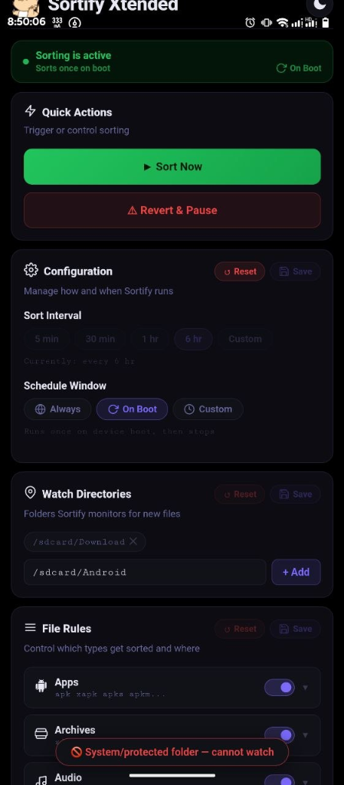
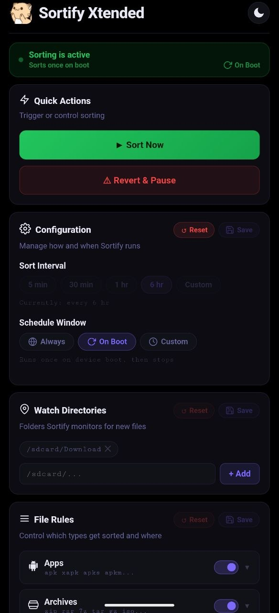
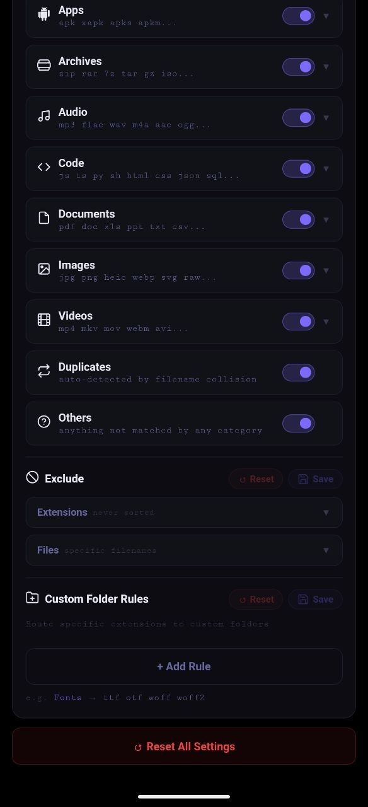

<p align="center">
  
</p>

# Sortify Xtended

<p align="left">
  
  
  
  <a href="LICENSE"></a>
</p>

Sortify Xtended is a root module for Android (Magisk, KernelSU, and APatch) that keeps your download folders organized. It automatically sorts incoming files into category directories, provides an offline WebUI inside your root manager, handles scheduling and collision renaming, and migrates setups from the original Sortify module.

Extended from [Sortify](https://github.com/xCaptaiN09/Sortify) by [xCaptaiN09](https://github.com/xCaptaiN09).

## Screenshots

<p align="center">
  
  &nbsp;
  
  &nbsp;
  
  &nbsp;
  
</p>

## Features

### File Sorting
- Runs in the background at an interval you set (default: 5 minutes).
- Watches `/sdcard/Download` by default, with support for extra folders.
- Skips in-progress downloads (`.crdownload`, `.part`, `.partial`), temporary files, hidden files, and files modified within the last 5 seconds.
- Skips Android flash images (`boot.img`, `init_boot.img`, `vendor_boot.img`, `recovery.img`) so rooting tools and fastboot workflows stay untouched.
- Duplicates move into `Duplicates/` with incremental suffix numbering (such as `file-1.zip`, `file-2.zip`), preventing existing duplicates from being overwritten.

### Subcategories
- Screenshots route to `Images/Screenshots` based on standard camera and screenshot naming conventions.
- Music files (MP3, FLAC, WAV, M4A, OGG, AAC, OPUS, ALAC) go to `Audio/Music`, while other audio formats remain in `Audio`.
- Root modules (`.zip` packages containing `module.prop`) are identified by reading archive headers directly and moved to `Archives/Modules` without full unzipping.

### Migration from Original Sortify
- When flashing the module, `customize.sh` checks for existing Sortify configurations and imports your settings.
- Files previously sorted under `/sdcard/Sortify` or `/sdcard/Download/Sortify` are moved back to your download directory with conflict renaming, and empty legacy folders are removed.
- The background service and manual action script also check for leftover legacy folders on boot.

### Safety Measures
- Root paths and sensitive directories (`/`, `/system`, `/data`, `/sdcard/Android`, `/sdcard/DCIM`) are blocked from watch list configurations.
- Directory cleanup only removes empty category folders; folders containing other files are left intact.

### Scheduling Options
- Always: sorts continuously on your configured timer.
- Night only: runs between 00:00 and 06:00.
- Custom window: runs only between times you specify (for example, 02:00 to 05:00).
- Boot only: runs once after Android boots and stays idle until the next reboot.

### Controls and Rollback
- Pause sorting for 1 hour, 3 hours, 24 hours, or until manually resumed.
- Undo the last sorting batch to restore files to their previous locations.
- Full revert moves all categorized files back to the download root safely.
- Uninstalling via `uninstall.sh` restores sorted files to their source folders before removing module files.

## WebUI

The module includes a local dashboard that runs directly inside KernelSU, APatch, or Magisk without requiring an external browser or internet connection.

### How to open
1. Open your root manager (KernelSU, APatch, or Magisk).
2. Go to the Modules tab.
3. Tap the WebUI or Action icon on the Sortify Xtended card.

### Available settings
- Dark and light theme toggle.
- Enable or disable individual categories (Documents, Images, Audio, Videos, Archives, Apps, Code, Duplicates, Others).
- Add custom file extensions to existing categories.
- Create custom folder rules (for example, sending `.psd` files directly to `Photoshop/`).
- Exclude specific file names or extensions from sorting.
- View live sorting logs and historical statistics.

## Manual Trigger

To trigger a sort cycle immediately without opening the WebUI:
- Tap the Action button on the module card in your root manager.
- Or run the script from a root shell:
  ```bash
  su -c sh /data/adb/modules/sortify_xtended/action.sh --force
  ```

## Installation

1. Download the flashable `sortify_xtended.zip` from [Releases](../../releases).
2. Flash the zip in Magisk, KernelSU, or APatch.
   The installer sets up the webroot, checks for older configs, and migrates legacy files with live terminal feedback.
3. Reboot your device.
4. Open your root manager and tap the WebUI button on Sortify Xtended to customize your settings.

## Credits

- Original Sortify module by [xCaptaiN09](https://github.com/xCaptaiN09) ([GitHub repository](https://github.com/xCaptaiN09/Sortify)).
- Xtended enhancements, WebUI dashboard, migration logic, and safety hardening by [Imnotshashwat](https://github.com/Imnotshashwat).